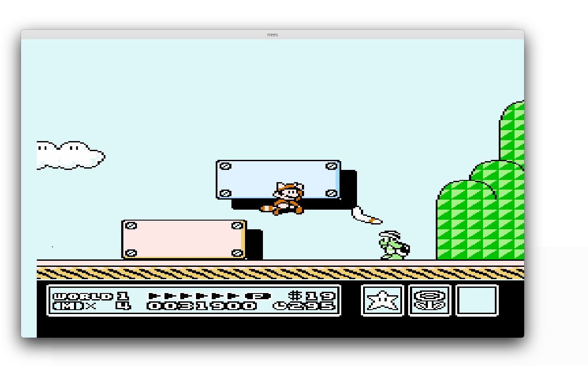

# nees
A (reasonably) accurate NES emulator with support for NROM/MMC3 games. Only runs on Linux with Vulkan-supported hardware. 




NOTE: Game compatibility remains low. Only mappers 0 and 4 are supported, and ROM parsing is limited to INES-1.0. As of writing, many of the more obscure INES-header flags are simply ignored (including the presence of a trainer). Conveniences like user interface or interactive debugging have also not been prioritized - the primary focus of the project has been on the emulator core itself. Stability has likewise been low-priority, with me pushing directly to master and breaking things every other commit. Hopefully, however, the project can still serve as guidance for people wishing to make similar programs in Rust.

### Features
* mapper 0 and 4 support
* simple save states
* nearly cycle accurate (but not cycle-steppable) CPU emulation, including dummy reads/writes
* almost 8-cycle accurate PPU emulation
* low level emulation of MMC3 IRQ counter behavior

### TODOs
* APU emulation
* cycle accurate CPU NMI/IRQ polling
* dummy PPU nametable fetches at dots 337-340

.. and tons more

### Tests
* instr_test_v5
    * [x] 01-basics
    * [x] 02-implied
    * [ ] 03-09 (unofficial opcodes aren't supported yet)
    * [x] 10-branches
    * [x] 11-stack
    * [x] 12-jmp_jsr
    * [x] 13-rts
    * [x] 14-rti
    * [x] 15-brk
    * [x] 16-special
* instr_misc
    * [x] 01-abs_x_wrap
    * [x] 02-branch_wrap
    * [x] 03-dummy_reads
    * [ ] 04-dummy_reads_apu (no apu emulation)
* instr_timing
    * [ ] 1-instr_timing (no apu emulation)
    * [ ] 2-branch_timing (no apu emulation)
* cpu_timing_test6
* branch_timing_tests
    * [x] 1.Branch_Basics.nes
    * [x] 2.Backward_Branch.nes
    * [x] 3.Forward_Branch.nes
* ppu_vbl_nmi
    * [x] 01-vbl_basics
    * [x] 02-vbl_set_time
    * [x] 03-vbl_clear_time
    * [x] 04-nmi_control
    * [ ] 05-nmi_timing (no cycle accurate nmi polling)
    * [x] 06-nmi_suppression
    * [ ] 07-nmi_on_timing (fails for unknown reasons - many other emulators seem to struggle with this one)
    * [x] 08-nmi_off_timing
    * [x] 09-even_odd_frames
    * [ ] 10-even_odd_timing (ppu cycle inaccuracies)
* ppu_sprite_overflow
    * [x] 01-basics
    * [x] 02-details
    * [ ] 03-timing (fails for reasons i've yet to investigate)
    * [x] 04-obscure
    * [ ] 05 (haven't investigated this either)
* mmc3_test_2
    * [x] 1-clocking
    * [x] 2-details
    * [x] 3-A12_clocking
    * [ ] 4-scanline_timing (ppu cycle inaccuracies)
    * [x] 5-MMC3
    * [ ] 6-MMC3 (only newer MMC3 revisions are supported - both test 5 and 6 cannot pass at once)


### Installation and Usage
to install, simply:
```bash
cargo install --path emulator/
```
run with:
```bash
nees [rom]
```
optionally:
```
nees [rom] --save [path/to/save/file]
```
Up/down/left/right are bound to WASD, A is bound to space, B is Shift, Select is F, and Start is Tab. Emulation can be paused by pressing Esc, stopped by pressing Ctrl+Q and saved by pressing P. Keybinds are currently not configurable (short of editing the source code).

### Build Dependencies
 - `libxcb`
 - `libxcb-keysyms`
 - `xcb-util`
 - `Vulkan SDK`
 - `cargo`
 
 .. and related dev headers
